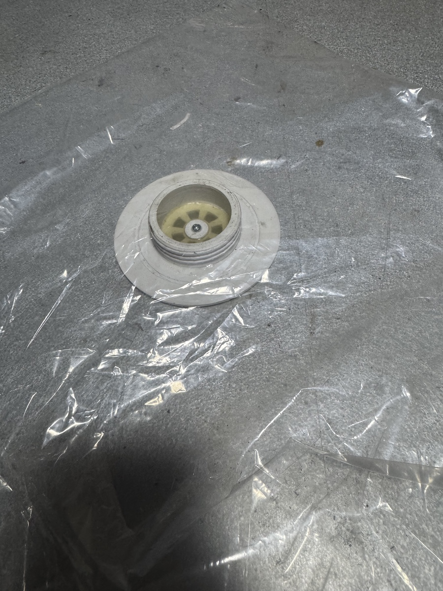
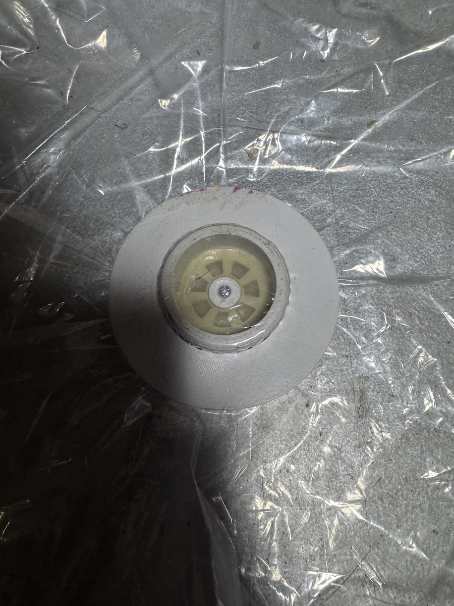
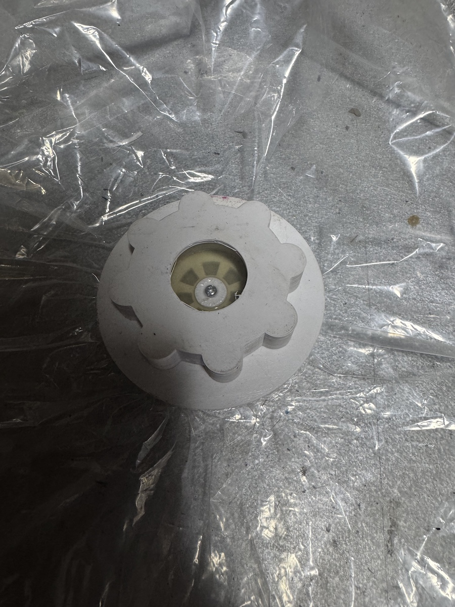
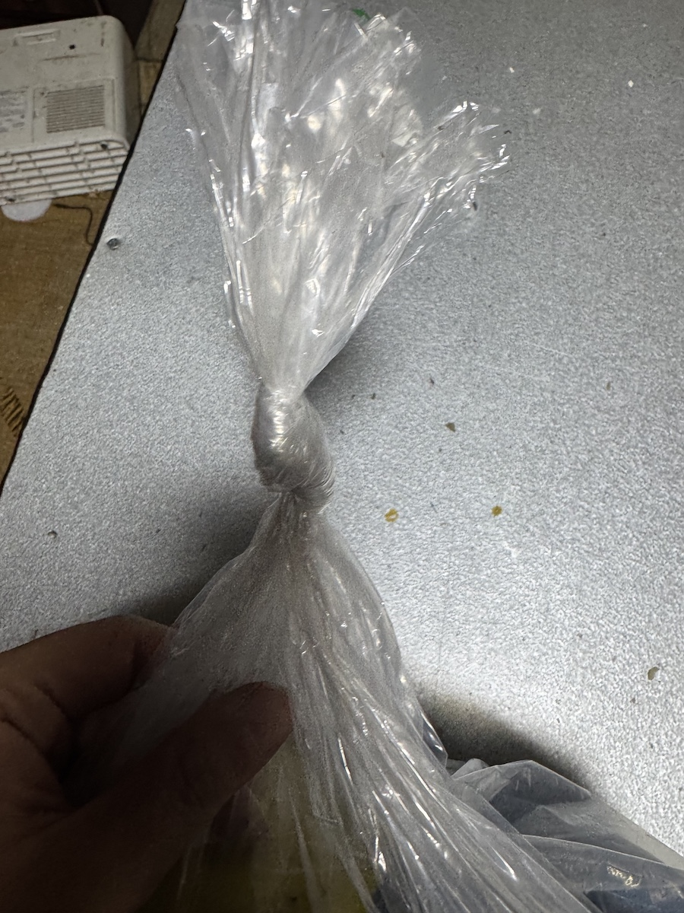
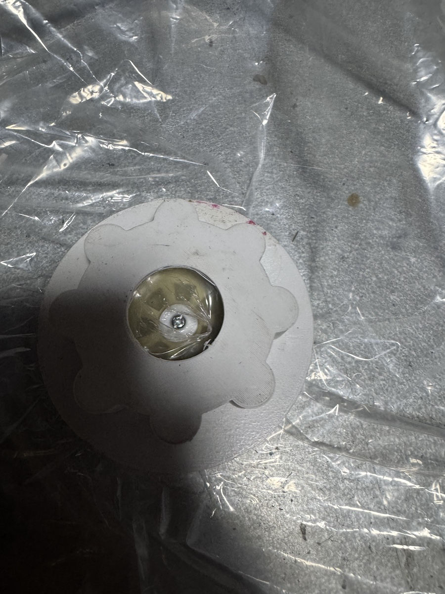

# 使用方法：伸縮性のない一般ゴミ袋を使う場合

本ドキュメントでは、
**伸縮性のない一般的なゴミ袋（PE / PP）** を使用して
「どこでもバキュームベット」を使う方法を示します。

この方法では **事前に袋へ穴を開けません**。

# How to use: non-stretch trash bags (CA/TX English)

This guide covers using **standard non-stretch trash bags (PE/PP)** with the Anywhere Vacuum Bed. With this method, **you do not pre-punch the bag**.

---

## 使用部品（STL）

- 逆流防止弁本体
  `逆流防止弁-AssemblyPocket005.stl`
- オスネジ
  `オスネジ-AssemblyAdditiveHelix.stl`
- 逆流防止弁ワッシャ（ゼロテンション）
  `逆流防止弁ワッシャ-AssemblyHole.stl`
- 押さえリング
  `押さえリング-AssemblyPad001.stl`
- ロックナット
  `ロックナット-AssemblySubtractiveHelix.stl`

**Parts (STL files)**

- Check-valve body: `逆流防止弁-AssemblyPocket005.stl`
- Male thread: `オスネジ-AssemblyAdditiveHelix.stl`
- Check-valve washer (zero tension): `逆流防止弁ワッシャ-AssemblyHole.stl`
- Retaining ring: `押さえリング-AssemblyPad001.stl`
- Locknut: `ロックナット-AssemblySubtractiveHelix.stl`

---

## 手順

### 手順1：袋の内側に弁ユニットを入れる

袋の**内側**に、`assembly.md` に従って **事前に組み立て済み** の
逆流防止弁ユニットをセットします。

#### 使用部品
- 逆流防止弁ワッシャ  
  `逆流防止弁ワッシャ-AssemblyHole.stl`
- 逆流防止弁本体  
  `逆流防止弁-AssemblyPocket005.stl`
- オスネジ  
  `オスネジ-AssemblyAdditiveHelix.stl`
- Latex 弁（ドーナツ状）

> 組み立て方法の詳細は  
> **`assembly.md` を熟読し、必ず先に組み立ててください。**

※ この時点では **袋に穴は開けません**。

### Step 1: Place the valve unit inside the bag

Insert the pre-assembled check-valve unit (per `assembly.md`) on the **inside** of the bag.

#### Parts used
- Check-valve washer: `逆流防止弁ワッシャ-AssemblyHole.stl`
- Check-valve body: `逆流防止弁-AssemblyPocket005.stl`
- Male thread: `オスネジ-AssemblyAdditiveHelix.stl`
- Latex valve (donut)

> Review `assembly.md` in detail and complete assembly first.

No holes are made in the bag at this stage.

---

---

### 手順2：袋の外側から押さえリングを挿入

袋の**外側**から、  
`押さえリング-AssemblyPad001.stl` を押し当てます。

- 袋は部品の間で**挟み込まれる構造**
- 袋素材がそのままシールとして機能します

### Step 2: Add the retaining ring from outside the bag

From the **outside**, press `押さえリング-AssemblyPad001.stl` against the bag.

- The bag is **clamped between the parts**.
- The bag material itself acts as the seal.

---

### 手順3：ロックナットで固定

袋の外側から  
`ロックナット-AssemblySubtractiveHelix.stl` をねじ込み、固定します。

- 強く締めすぎない
- 袋が均一に挟まれていることを確認

### Step 3: Lock with the nut

Thread `ロックナット-AssemblySubtractiveHelix.stl` from the outside and secure it.

- Do not overtighten.
- Confirm the bag is clamped evenly.

---

### 手順4：内容物を入れて袋を縛る

- 袋の中に内容物を入れます
- 袋の口を縛り、密閉します

この時点では、
**袋はまだ完全に密閉された状態**です。

### Step 4: Load the contents and tie the bag

Place the contents inside, then tie the bag closed. At this point the bag remains fully sealed.

---

### 手順5：中央を破って吸引開始

吸引前に、  
**中央吸入口に指を入れて袋を破ります**。

- 事前の穴あけ不要
- 吸入口位置で自然に破断
- 破断後も袋が吸い込まれにくい構造

そのまま掃除機を接続し、吸引を開始します。

### Step 5: Tear the center and start vacuuming

Before pulling vacuum, **poke the center inlet with your finger to tear the film**, then connect the vacuum and start suction.

---

## 補足

- 伸縮性のない袋でも問題なく使用できます
- 破断は **必ず吸引直前** に行ってください
- シリコングリスを併用すると気密が安定します
- 解除時は、ロックナットを外して袋端をつまむだけです

## Tips

- Non-stretch bags work fine.
- Always tear **right before** pulling vacuum.
- Silicone grease helps stabilize the seal.
- To release, remove the locknut and pinch the bag edge.

---

## 注意

- 使用は **自己責任** です
- 人体・物体を問わず、
  本設計は安全認証を意図したものではありません

## Warnings

- Use entirely at your own risk.
- This design is not intended for any certified safety use with people or objects.

---

